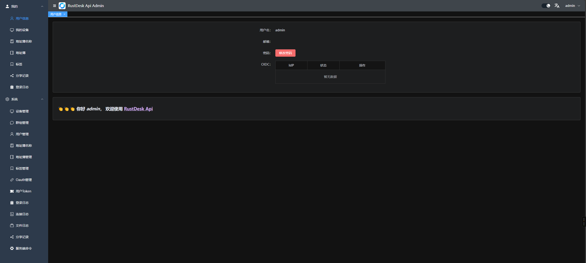
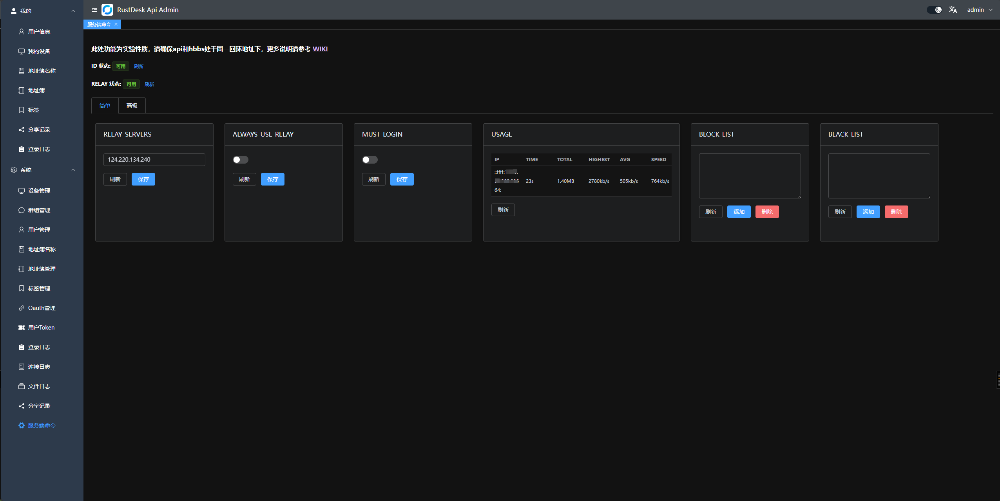

# KustDesk Server

[](https://github.com/Kayungko/kustdesk-server/actions/workflows/build.yaml)

- 解决当客户端登录了`API`账号时链接超时的问题
- s6镜像添加了`API`支持，`API`开源地址 https://github.com/Kayungko/kustdesk-server
- 是否必须登录才能链接， `MUST_LOGIN` 默认为 `N`，设置为 `Y` 则必须登录才能链接
- `RUSTDESK_API_JWT_KEY`，设置后会通过`JWT`校验token的合法性
- 支持client websocket (client >= 1.4.1)

## Docker镜像地址

- s6 镜像 [kayungko/kustdesk-server-s6](https://hub.docker.com/r/kayungko/kustdesk-server-s6)

```yaml
 networks:
   rustdesk-net:
     external: false
 services:
   rustdesk:
     ports:
       - 21114:21114
       - 21115:21115
       - 21116:21116
       - 21116:21116/udp
       - 21117:21117
       - 21118:21118
       - 21119:21119
     image: kayungko/kustdesk-server-s6:latest
     environment:
       - RELAY=<relay_server[:port]>
       - ENCRYPTED_ONLY=1
       - MUST_LOGIN=N
       - TZ=Asia/Shanghai
       - RUSTDESK_API_RUSTDESK_ID_SERVER=<id_server[:21116]>
       - RUSTDESK_API_RUSTDESK_RELAY_SERVER=<relay_server[:21117]>
       - RUSTDESK_API_RUSTDESK_API_SERVER=http://<api_server[:21114]>
       - RUSTDESK_API_KEY_FILE=/data/id_ed25519.pub
       - RUSTDESK_API_JWT_KEY=xxxxxx # jwt key
     volumes:
       - /data/rustdesk/server:/data
       - /data/rustdesk/api:/app/data #将数据库挂载
     networks:
       - rustdesk-net
     restart: unless-stopped
       
```

- 普通镜像 [kayungko/kustdesk-server](https://hub.docker.com/r/kayungko/kustdesk-server)


# API功能截图





更多查看 [KustDesk API](https://github.com/Kayungko/kustdesk-server)


--- 

<p align="center">
  <a href="#如何自行构建">自行构建</a> •
  <a href="#Docker-镜像">Docker</a> •
  <a href="#基于-S6-overlay-的镜像">S6-overlay</a> •
  <a href="#如何创建密钥">密钥</a> •
  <a href="#deb-套件">Debian</a> •
  <a href="#ENV-环境参数">环境参数</a><br>
  [<a href="README-EN.md">English</a>] | [<a href="README-DE.md">Deutsch</a>] | [<a href="README-NL.md">Nederlands</a>] | [<a href="README-TW.md">繁体中文</a>]<br>
</p>

# KustDesk Server Program


[**下载**](https://github.com/Kayungko/kustdesk-server/releases)

[**说明文件**](https://rustdesk.com/docs/zh-cn/self-host/)

自行搭建属于你的RustDesk服务器,所有的一切都是免费且开源的

## 如何自行构建

```bash
cargo build --release
```

执行后会在target/release目录下生成三个对应平台的可执行程序

- hbbs - RustDesk ID/会和服务器
- hbbr - RustDesk 中继服务器
- rustdesk-utils - RustDesk 命令行工具

您可以在 [releases](https://github.com/Kayungko/kustdesk-server/releases) 页面中找到最新的服务端软件。

如果您需要额外的功能支持，[RustDesk 专业版服务器](https://rustdesk.com/pricing.html) 获取更适合您。

如果您想开发自己的服务器，[rustdesk-server-demo](https://github.com/rustdesk/rustdesk-server-demo) 应该会比直接使用这个仓库更简单快捷。

## Docker 镜像

Docker镜像会在每次 GitHub 发布新的release版本时自动构建。我们提供两种类型的镜像。

### Classic 传统镜像

这个类型的镜像是基于 `ubuntu-20.04` 进行构建，镜像仅包含两个主要的可执行程序（`hbbr` 和 `hbbs`）。它们可以通过以下tag在 [Docker Hub](https://hub.docker.com/r/lejianwen/rustdesk-server/) 上获得：

| 架构      | image:tag                                 |
|---------| ----------------------------------------- |
| amd64   | `lejianwen/rustdesk-server:latest`         |
| arm64v8 | `lejianwen/rustdesk-server:latest-arm64v8` |

您可以使用以下命令，直接通过 ``docker run`` 來启动这些镜像：

```bash
docker run --name hbbs --net=host -v "$PWD/data:/root" -d lejianwen/rustdesk-server:latest hbbs -r <relay-server-ip[:port]> 
docker run --name hbbr --net=host -v "$PWD/data:/root" -d lejianwen/rustdesk-server:latest hbbr 
```

或不使用 `--net=host` 参数启动， 但这样 P2P 直连功能将无法工作。

对于使用了 SELinux 的系统，您需要将 ``/root`` 替换为 ``/root:z``，以保证容器的正常运行。或者，也可以通过添加参数 ``--security-opt label=disable`` 来完全禁用 SELinux 容器隔离。

```bash
docker run --name hbbs -p 21115:21115 -p 21116:21116 -p 21116:21116/udp -p 21118:21118 -v "$PWD/data:/root" -d lejianwen/rustdesk-server:latest hbbs -r <relay-server-ip[:port]> 
docker run --name hbbr -p 21117:21117 -p 21119:21119 -v "$PWD/data:/root" -d lejianwen/rustdesk-server:latest hbbr 
```

`relay-server-ip` 参数是运行这些容器的服务器的 IP 地址（或 DNS 名称）。如果你不想使用 **21117** 作为 `hbbr` 的服务端口,可使用可选参数 `port` 进行指定。

您也可以使用 docker-compose 进行构建,以下为配置示例：

```yaml
version: '3'

networks:
  rustdesk-net:
    external: false

services:
  hbbs:
    container_name: hbbs
    ports:
      - 21115:21115
      - 21116:21116
      - 21116:21116/udp
      - 21118:21118
    image: lejianwen/rustdesk-server:latest
    command: hbbs -r rustdesk.example.com:21117
    volumes:
      - ./data:/root
    networks:
      - rustdesk-net
    depends_on:
      - hbbr
    restart: unless-stopped

  hbbr:
    container_name: hbbr
    ports:
      - 21117:21117
      - 21119:21119
    image: lejianwen/rustdesk-server:latest
    command: hbbr
    volumes:
      - ./data:/root
    networks:
      - rustdesk-net
    restart: unless-stopped
```

编辑第16行来指定你的中继服务器 （默认端口监听在 21117 的那一个）。 如果需要的话，您也可以编辑 volume 信息  (第 18 和 33 行)。

（感谢 @lukebarone 和 @QuiGonLeong 协助提供的 docker-compose 配置示例）

## 基于 S6-overlay 的镜像

> 这些镜像是针对 `busybox:stable` 构建的，并添加了可执行程序（hbbr 和 hbbs）以及 [S6-overlay](https://github.com/just-containers/s6-overlay)。 它们可以使用以下tag在 [Docker hub](https://hub.docker.com/r/lejianwen/rustdesk-server-s6/) 上获取：


| 架構      | version | image:tag                                    |
| --------- | ------- | -------------------------------------------- |
| multiarch | latest  | `lejianwen/rustdesk-server-s6:latest`         |
| amd64     | latest  | `lejianwen/rustdesk-server-s6:latest-amd64`   |
| i386      | latest  | `lejianwen/rustdesk-server-s6:latest-i386`    |
| arm64v8   | latest  | `lejianwen/rustdesk-server-s6:latest-arm64v8` |
| armv7     | latest  | `lejianwen/rustdesk-server-s6:latest-armv7`   |
| multiarch | 2       | `lejianwen/rustdesk-server-s6:2`              |
| amd64     | 2       | `lejianwen/rustdesk-server-s6:2-amd64`        |
| i386      | 2       | `lejianwen/rustdesk-server-s6:2-i386`         |
| arm64v8   | 2       | `lejianwen/rustdesk-server-s6:2-arm64v8`      |
| armv7     | 2       | `lejianwen/rustdesk-server-s6:2-armv7`        |
| multiarch | 2.0.0   | `lejianwen/rustdesk-server-s6:2.0.0`          |
| amd64     | 2.0.0   | `lejianwen/rustdesk-server-s6:2.0.0-amd64`    |
| i386      | 2.0.0   | `lejianwen/rustdesk-server-s6:2.0.0-i386`     |
| arm64v8   | 2.0.0   | `lejianwen/rustdesk-server-s6:2.0.0-arm64v8`  |
| armv7     | 2.0.0   | `lejianwen/rustdesk-server-s6:2.0.0-armv7`    |

强烈建议您使用`major version` 或 `latest` tag 的 `multiarch` 架构的镜像。

S6-overlay 在此处作为监控程序，用以保证两个进程的运行，因此使用此镜像，您无需运行两个容器。

您可以使用 `docker run` 命令直接启动镜像，如下：

```bash
docker run --name rustdesk-server \ 
  --net=host \
  -e "RELAY=rustdeskrelay.example.com" \
  -e "ENCRYPTED_ONLY=1" \
  -v "$PWD/data:/data" -d lejianwen/rustdesk-server-s6:latest
```

或刪去 `--net=host` 参数， 但 P2P 直连功能将无法工作。

```bash
docker run --name rustdesk-server \
  -p 21115:21115 -p 21116:21116 -p 21116:21116/udp \
  -p 21117:21117 -p 21118:21118 -p 21119:21119 \
  -e "RELAY=rustdeskrelay.example.com" \
  -e "ENCRYPTED_ONLY=1" \
  -v "$PWD/data:/data" -d lejianwen/rustdesk-server-s6:latest
```

或着您也可以使用 docker-compose 文件:

```yaml
version: '3'

services:
  rustdesk-server:
    container_name: rustdesk-server
    ports:
      - 21114:21114
      - 21115:21115
      - 21116:21116
      - 21116:21116/udp
      - 21117:21117
      - 21118:21118
      - 21119:21119
    image: lejianwen/rustdesk-server-s6:latest
    environment:
      - "RELAY=rustdesk.example.com:21117"
      - "ENCRYPTED_ONLY=1"
    volumes:
      - ./data:/data
    restart: unless-stopped
```

对于此容器镜像，除了在下面的环境变量部分指定的变量之外，您还可以使用以下`环境变量`

| 环境变量           | 是否可选 | 描述                       |
|----------------|------|--------------------------|
| RELAY          | 否    | 运行此容器的宿主机的 IP 地址/ DNS 名称 |
| ENCRYPTED_ONLY | 是    | 如果设置为 **"1"**，将不接受未加密的连接。 |
| KEY_PUB        | 是    | 密钥对中的公钥（Public Key）      |
| KEY_PRIV       | 是    | 密钥对中的私钥（Private Key）     |

###  基于 S6-overlay 镜像的密钥管理

您可以将密钥对保存在 Docker volume 中，但我们建议不要将密钥写入文件系統中；因此，我们提供了一些方案。

在容器启动时，会检查密钥对是否存在（`/data/id_ed25519.pub` 和 `/data/id_ed25519`），如果其中一個密钥不存在，则会从环境变量或 Docker Secret 中重新生成它。
然后检查密钥对的可用性：如果公钥和私钥不匹配，容器将停止运行。
如果您未提供密钥，`hbbs` 将会在默认位置生成一个。

#### 使用 ENV 存储密钥对

您可以使用 Docker 环境变量來存储密钥。如下：

```bash
docker run --name rustdesk-server \ 
  --net=host \
  -e "RELAY=rustdeskrelay.example.com" \
  -e "ENCRYPTED_ONLY=1" \
  -e "DB_URL=/db/db_v2.sqlite3" \
  -e "KEY_PRIV=FR2j78IxfwJNR+HjLluQ2Nh7eEryEeIZCwiQDPVe+PaITKyShphHAsPLn7So0OqRs92nGvSRdFJnE2MSyrKTIQ==" \
  -e "KEY_PUB=iEyskoaYRwLDy5+0qNDqkbPdpxr0kXRSZxNjEsqykyE=" \
  -v "$PWD/db:/db" -d lejianwen/rustdesk-server-s6:latest
```

```yaml
version: '3'

services:
  rustdesk-server:
    container_name: rustdesk-server
    ports:
      - 21114:21114
      - 21115:21115
      - 21116:21116
      - 21116:21116/udp
      - 21117:21117
      - 21118:21118
      - 21119:21119
    image: lejianwen/rustdesk-server-s6:latest
    environment:
      - "RELAY=rustdesk.example.com:21117"
      - "ENCRYPTED_ONLY=1"
      - "DB_URL=/db/db_v2.sqlite3"
      - "KEY_PRIV=FR2j78IxfwJNR+HjLluQ2Nh7eEryEeIZCwiQDPVe+PaITKyShphHAsPLn7So0OqRs92nGvSRdFJnE2MSyrKTIQ=="
      - "KEY_PUB=iEyskoaYRwLDy5+0qNDqkbPdpxr0kXRSZxNjEsqykyE="
    volumes:
      - ./db:/db
    restart: unless-stopped
```

#### 使用 Docker Secret 來保存密钥对

您还可以使用 Docker Secret 來保存密钥。
如果您使用 **docker-compose** 或 **docker swarm**，推荐您使用。
只需按照以下示例操作：

```bash
cat secrets/id_ed25519.pub | docker secret create key_pub -
cat secrets/id_ed25519 | docker secret create key_priv -
docker service create --name rustdesk-server \
  --secret key_priv --secret key_pub \
  --net=host \
  -e "RELAY=rustdeskrelay.example.com" \
  -e "ENCRYPTED_ONLY=1" \
  -e "DB_URL=/db/db_v2.sqlite3" \
  --mount "type=bind,source=$PWD/db,destination=/db" \
  lejianwen/rustdesk-server-s6:latest
```

```yaml
version: '3'

services:
  rustdesk-server:
    container_name: rustdesk-server
    ports:
      - 21114:21114
      - 21115:21115
      - 21116:21116
      - 21116:21116/udp
      - 21117:21117
      - 21118:21118
      - 21119:21119
    image: lejianwen/rustdesk-server-s6:latest
    environment:
      - "RELAY=rustdesk.example.com:21117"
      - "ENCRYPTED_ONLY=1"
      - "DB_URL=/db/db_v2.sqlite3"
    volumes:
      - ./db:/db
    restart: unless-stopped
    secrets:
      - key_pub
      - key_priv

secrets:
  key_pub:
    file: secrets/id_ed25519.pub
  key_priv:
    file: secrets/id_ed25519      
```

## 如何生成密钥对

加密需要一对密钥；您可以按照前面所述提供它，但需要一个工具去生成密钥对。

您可以使用以下命令生成一对密钥：

```bash
/usr/bin/rustdesk-utils genkeypair
```

如果您沒有（或不想）在系统上安装 `rustdesk-utils` 套件，您可以使用 Docker 执行相同的命令：

```bash
docker run --rm --entrypoint /usr/bin/rustdesk-utils  lejianwen/rustdesk-server-s6:latest genkeypair
```

运行后的输出内容如下：

```text
Public Key:  8BLLhtzUBU/XKAH4mep3p+IX4DSApe7qbAwNH9nv4yA=
Secret Key:  egAVd44u33ZEUIDTtksGcHeVeAwywarEdHmf99KM5ajwEsuG3NQFT9coAfiZ6nen4hfgNICl7upsDA0f2e/jIA==
```

## .deb 套件

每个可执行文件都有单独的 .deb 套件可供使用，您可以在 [releases](https://github.com/lejianwen/rustdesk-server/releases) 页面中找到它們。
這些套件适用于以下发行版：

- Ubuntu 22.04 LTS
- Ubuntu 20.04 LTS
- Ubuntu 18.04 LTS
- Debian 11 bullseye
- Debian 10 buster

## ENV 环境变量

可以使用这些`环境变量`参数來配置 hbbs 和 hbbr。
您可以像往常一样指定参数，或者使用 .env 文件。

| 参数                    | 可执行文件         | 描述                                               |
|-----------------------|---------------|--------------------------------------------------|
| ALWAYS_USE_RELAY      | hbbs          | 如果设定为 **"Y"**，将关闭直接点对点连接功能                       |
| DB_URL                | hbbs          | 数据库配置                                            |
| DOWNGRADE_START_CHECK | hbbr          | 降级检查之前的延迟是啊尽（以秒为单位）                              |
| DOWNGRADE_THRESHOLD   | hbbr          | 降级检查的阈值（bit/ms）                                  |
| KEY                   | hbbs/hbbr     | 如果设置了此参数，将强制使用指定密钥对，如果设为 **"_"**，则强制使用任意密钥       |
| LIMIT_SPEED           | hbbr          | 速度限制（以Mb/s为单位）                                   |
| PORT                  | hbbs/hbbr     | 监听端口（hbbs为21116，hbbr为21117）                      |
| RELAY_SERVERS         | hbbs          | 运行hbbr的机器的IP地址/DNS名称（用逗号分隔）                      |
| RUST_LOG              | all           | 设置 debug level (error\|warn\|info\|debug\|trace) |
| SINGLE_BANDWIDTH      | hbbr          | 单个连接的最大带宽（以Mb/s为单位）                              |
| TOTAL_BANDWIDTH       | hbbr          | 最大总带宽（以Mb/s为单位）                                  |

---

# 🚀 完整构建教程

## 📋 构建前准备

### 系统要求
- **操作系统**: Linux, macOS, Windows
- **Rust版本**: 1.76+ (推荐最新稳定版)
- **内存**: 至少2GB可用内存
- **磁盘空间**: 至少1GB可用空间

### 安装Rust
```bash
# 安装Rust
curl --proto '=https' --tlsv1.2 -sSf https://sh.rustup.rs | sh

# 重新加载环境变量
source ~/.cargo/env

# 验证安装
rustc --version
cargo --version
```

## 🔧 本地构建

### 1. 克隆项目
```bash
# 克隆主项目
git clone https://github.com/Kayungko/kustdesk-server.git
cd kustdesk-server

# 初始化子模块
git submodule update --init --recursive
```

### 2. 构建项目
```bash
# 开发构建
cargo build

# 发布构建
cargo build --release

# 构建特定二进制文件
cargo build --release --bin hbbs --bin hbbr --bin rustdesk-utils
```

### 3. 构建产物
构建完成后，可执行文件位于 `target/release/` 目录：
```bash
ls -la target/release/
# hbbs          # ID服务器
# hbbr          # 中继服务器  
# rustdesk-utils # 工具集
```

## 🐳 Docker构建

### 1. 使用Dockerfile.simple构建
```bash
# 构建镜像
docker build -f Dockerfile.simple -t kayung1012/kustdesk-server:latest .

# 查看构建的镜像
docker images | grep kustdesk-server
```

### 2. 使用官方Dockerfile构建
```bash
# 构建S6-overlay镜像
docker build -f docker/Dockerfile -t kayung1012/kustdesk-server-s6:latest .

# 构建普通镜像
docker build -f docker/Dockerfile -t kayung1012/kustdesk-server:latest .
```

### 3. 多平台构建
```bash
# 启用Docker Buildx
docker buildx create --use

# 构建多平台镜像
docker buildx build --platform linux/amd64,linux/arm64 \
  -f Dockerfile.simple \
  -t kayung1012/kustdesk-server:latest \
  --push .
```

## 🚀 部署方式

### 方式1: 直接运行
```bash
# 启动ID服务器
./target/release/hbbs -k /path/to/key -r 192.168.1.66:21117

# 启动中继服务器
./target/release/hbbr -k /path/to/key -r 192.168.1.66:21117
```

### 方式2: Docker Compose部署
```bash
# 使用完整配置部署
docker-compose -f docker-compose-complete.yml up -d

# 查看服务状态
docker-compose -f docker-compose-complete.yml ps

# 查看日志
docker-compose -f docker-compose-complete.yml logs -f
```

### 方式3: 系统服务部署
```bash
# 复制systemd服务文件
sudo cp systemd/rustdesk-server.service /etc/systemd/system/

# 重新加载systemd
sudo systemctl daemon-reload

# 启用并启动服务
sudo systemctl enable rustdesk-server
sudo systemctl start rustdesk-server
```

## 🔑 密钥管理

### 生成密钥对
```bash
# 使用rustdesk-utils生成
./target/release/rustdesk-utils genkeypair

# 或使用Docker镜像生成
docker run --rm kayung1012/kustdesk-server:latest \
  /usr/bin/rustdesk-utils genkeypair
```

### 密钥配置
```bash
# 设置环境变量
export KEY_PUB="your_public_key"
export KEY_PRIV="your_private_key"

# 或创建密钥文件
echo "your_public_key" > /data/id_ed25519.pub
echo "your_private_key" > /data/id_ed25519
```

## ⚙️ 环境变量配置

### 核心配置
```bash
# 服务器配置
RELAY=192.168.1.66:21117          # 中继服务器地址
ENCRYPTED_ONLY=1                   # 仅允许加密连接
MUST_LOGIN=Y                       # 必须登录才能连接

# API集成配置
RUSTDESK_API_RUSTDESK_ID_SERVER=192.168.1.66:21116
RUSTDESK_API_RUSTDESK_RELAY_SERVER=192.168.1.66:21117
RUSTDESK_API_RUSTDESK_API_SERVER=http://192.168.1.66:21114
RUSTDESK_API_JWT_KEY=your_jwt_secret_here
```

### 性能配置
```bash
# 带宽限制
LIMIT_SPEED=4Mb/s                  # 单个连接速度限制
TOTAL_BANDWIDTH=1024Mb/s           # 总带宽限制
SINGLE_BANDWIDTH=16Mb/s            # 单连接最大带宽

# 连接配置
DOWNGRADE_THRESHOLD=0.66           # 降级阈值
DOWNGRADE_START_CHECK=1800s        # 降级检查延迟
```

## 📊 监控和日志

### 查看服务状态
```bash
# Docker状态
docker ps | grep kustdesk

# 系统服务状态
sudo systemctl status rustdesk-server

# 端口监听状态
netstat -tlnp | grep -E "2111[5-9]"
```

### 查看日志
```bash
# Docker日志
docker logs kustdesk-server

# 系统服务日志
sudo journalctl -u rustdesk-server -f

# 实时日志
tail -f /var/log/rustdesk-server.log
```

## 🔧 故障排除

### 常见问题

#### 1. 端口被占用
```bash
# 检查端口占用
sudo lsof -i :21116
sudo netstat -tlnp | grep 21116

# 释放端口
sudo kill -9 <PID>
```

#### 2. 权限问题
```bash
# 检查文件权限
ls -la /data/rustdesk/
sudo chown -R rustdesk:rustdesk /data/rustdesk/
sudo chmod 755 /data/rustdesk/
```

#### 3. 网络连接问题
```bash
# 检查防火墙
sudo ufw status
sudo ufw allow 21115:21119/tcp
sudo ufw allow 21116/udp

# 检查SELinux
sudo setsebool -P httpd_can_network_connect 1
```

### 性能优化
```bash
# 调整系统参数
echo 'net.core.rmem_max = 134217728' >> /etc/sysctl.conf
echo 'net.core.wmem_max = 134217728' >> /etc/sysctl.conf
sudo sysctl -p

# 优化Docker配置
echo '{"default-ulimits":{"nofile":{"name":"nofile","hard":65536,"soft":65536}}}' >> /etc/docker/daemon.json
sudo systemctl restart docker
```

## 📚 相关资源

### 官方文档
- [RustDesk官方文档](https://rustdesk.com/docs/)
- [自托管指南](https://rustdesk.com/docs/zh-cn/self-host/)

### 社区资源
- [GitHub Issues](https://github.com/Kayungko/kustdesk-server/issues)
- [Discord社区](https://discord.gg/nDceKgxnkV)

### 工具和脚本
- [一键部署脚本](./scripts/deploy.sh)
- [监控脚本](./scripts/monitor.sh)
- [备份脚本](./scripts/backup.sh)

---

## 🤝 贡献指南

### 提交Issue
1. 使用Issue模板
2. 提供详细的错误信息
3. 包含系统环境信息
4. 附上相关日志

### 提交PR
1. Fork项目到你的仓库
2. 创建功能分支
3. 提交代码更改
4. 创建Pull Request

### 代码规范
- 遵循Rust编码规范
- 添加适当的注释
- 编写单元测试
- 更新相关文档

---

## 📄 许可证

本项目基于 [AGPL-3.0](LICENSE) 许可证开源。

---

## 📞 联系我们

- **GitHub**: [https://github.com/Kayungko](https://github.com/Kayungko)
- **项目地址**: [https://github.com/Kayungko/kustdesk-server](https://github.com/Kayungko/kustdesk-server)
- **Docker Hub**: [https://hub.docker.com/r/kayung1012/kustdesk-server](https://hub.docker.com/r/kayung1012/kustdesk-server)

---

**KustDesk Server** - 为KustDesk生态提供强大的服务器支持 🚀
